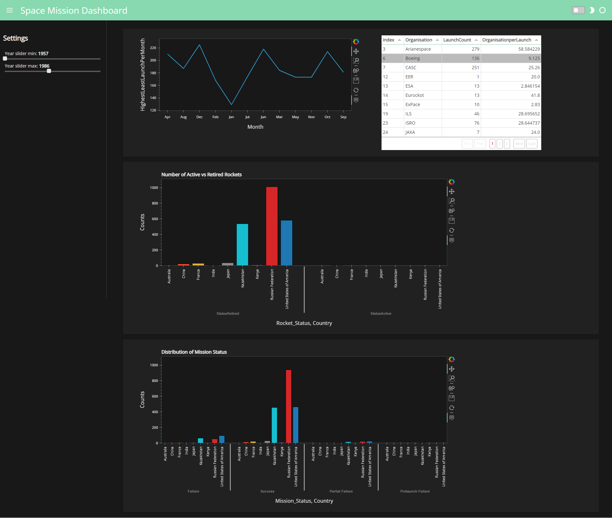

# Interactive Data Visualization using Python like Dashboard Template
nextspaceflight.com that includes all the space missions since the beginning of Space Race between the USA and the Soviet Union in 1957

#### How to make interactive data visualization for presentation using python

